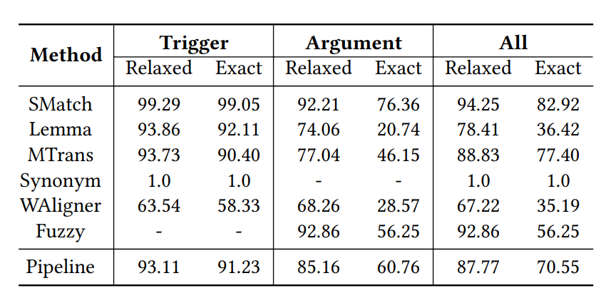

# LinguAligner
LinguALigner is a comprehensive corpus translation and alignment pipeline designed to facilitate the translation of corpora across different languages. It translates corpora using machine translation and aligns the translated annotations with their corresponding translated text. Initially developed for the automatic translation of ACE-2005 into Portuguese, LinguALigner has since been adapted into a versatile package for effortless translation of other corpora.

It is composed of two main components: 

- Text translation: We support DeepL Translator, Google Translator and Microsoft Translators APIs. 
- Annotations alignments: We developed an annotation alignment pipeline that uses several alignment techniques to align the translated annotations within the translated text.


## Annotation Alignment Modules
Our pipeline is composed of a total of five annotation alignment components:

    - Lemmatization
    - Multiple word translation
    - BERT-based word aligner
    - Gestalt Patter Matching
    - Levenstein distance

The pipeline operates sequentially, meaning that annotations aligned by earlier methods are not addressed by subsequent pipeline elements. According to our experiments, the list above corresponds to the best order sequence.


## Usage


1. **Translate Corpora**
    You can use the Translation APIs or can translate your corpus with an external tool
    An API key is need in order to use the Translation APIs.
    (in progress)


2. **Run the Annotation Alignment Pipeline**
   Users can select the aligners they intend to use and must indicate the path for the alignment resources for each alignment component, such as multiple translations of annotations, previously calculated lemmas, synonyms, etc. 

```
from LinguAligner import Pipeline

"""
(By default, the first method used is string matching. If unsuccessful, the alignment pipeline is employed.)
Methods:
- lemma: Lemmatization
- M_Trans: Multiple Translations of a word
- word_aligner: mBERT-based word aligner
- gestalt: Gestalt pattern matching (character-based)
- levenshtein: Levenshtein distance (character-based)
"""

config= {
    "pipeline": [ "lemma", "M_Trans", "word_aligner","gestalt","leveinstein"], # can be changed according to the desired pipeline
    "spacy_model": "pt_core_news_lg", # change according to the language
    "WAligner_model": "bert-base-multilingual-uncased", # needed for word_aligner
}


aligner = Pipeline(config)
x = aligner.align_annotation("The soldiers were ordered to fire their weapons.", "fire", "Os soldados receberam ordens para disparar as suas armas.","incêndio")
print(x)

>>> "disparar"
```
For example, in the sentence 'The soldiers were ordered to fire their weapons,' the word 'fire' was annotated in the source corpus. However, when this sentence is translated to 'Os soldados receberam ordens para disparar as suas armas,' the word 'fire' is translated to 'incêndio' (fire as a noun) in isolation, and to 'disparar' (as a verb) in the translated sentence.

** Note ** 

To use the M_trans method, multiple translations of the annotations must be computed beforehand and passed as an argument to the align_annotation function. These translations should contained in a Python dictionary, where the source annotation serves as the key, and the corresponding value is a list of alternative translations. You can generate this dictionary using the following code (need a MICROSOFT_TRANSLATOR_KEY):


```

from LinguAligner import multiple_translations
lookupTable = {}
annotations_list = ["war","land","fire"]
key = "MICROSOFT_TRANSLATOR_KEY"
for word in annotations_list:
    lookupTable[word] = multiple_translations.getMultipleTranslations(word,"en-en","pt-pt",key) # change the language codes according to the desired languages

# Then, pass the lookupTable to the align_annotation method
x = aligner.align_annotation("The soldiers were ordered to fire their weapons","fire", "Os soldados receberam ordens para disparar as suas armas","incêndio",lookupTable)


```

## Evaluation
To measure the effectiveness of the alignment pipeline we tested it on ACE-2005 corpus. Manual alignments were conducted on the entire ACE-2005-PT test set, which includes 1,310 annotations. These alignments were performed by a linguist expert to ensure high-quality annotations, following the same annotation [guidelines](https://www.ldc.upenn.edu/sites/www.ldc.upenn.edu/files/english-events-guidelines-v5.4.3.pdf) of the original ACE-2005 corpus.

The evaluation results are presented in Table 1:

<p>
    
    <br>
    <em>Table 1: Evaluation Results by pipeline component</em>
</p>


## License

This project is licensed under the [MIT License](LICENSE).

## Citation

Comming Soon.


